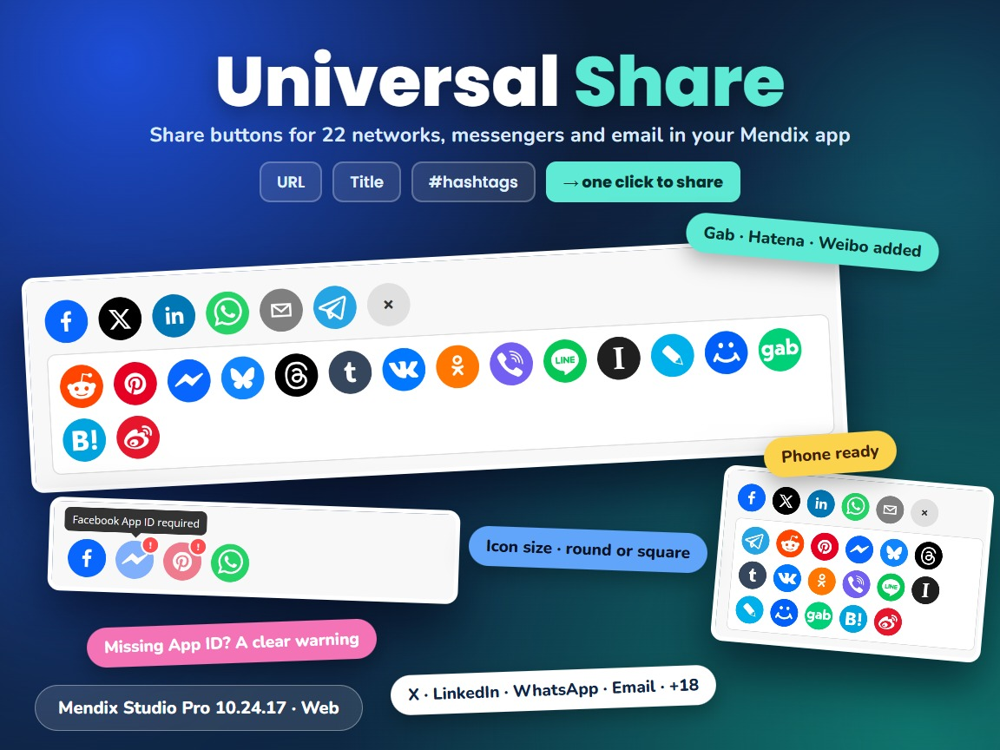

# Universal Share

A Mendix pluggable widget with share buttons for 22 social networks, messengers and email. The URL, title, description, hashtags, image and the list of platforms come from attributes, so every page or object can share its own content on its own set of platforms. Built on [react-share](https://github.com/nygardk/react-share).



## Documentation

- [Universal Share 10.24.17.docx](docs/Universal%20Share%2010.24.17.docx): install, upgrade, configuration, properties, examples, styling and limitations.
- [Marketplace documentation](docs/Marketplace%20Documentation%20-%20Universal%20Share.md): the same in short form.

## Version 1.1.0 for Mendix Studio Pro 10.24.17

- Download `mendix.UniversalShare.mpk` from the release [Version1.1.0](https://github.com/bharathidas/UniversalShare/releases/tag/Version1.1.0) or from the root of this repository.
- The previous package (1.0.0, Mendix 10.18.4) is in release [Version1.0.0](https://github.com/bharathidas/UniversalShare/releases/tag/Version1.0.0).
- Copy it into the `widgets` folder of your app and press **F4** (App > Synchronize App Directory) in Studio Pro.
- Place **Universal Share** in a data view and select the attributes.

## Platforms

`facebook`, `messenger`, `twitter` (or `x`), `linkedin`, `whatsapp`, `telegram`, `reddit`, `pinterest`, `email`, `bluesky`, `threads`, `tumblr`, `vk`, `ok`, `viber`, `line`, `instapaper`, `livejournal`, `mailru`, `gab`, `hatena`, `weibo`

Write them comma-separated in the Platforms attribute, in the order they should be shown. Upper case and spaces are ignored; unknown names and duplicates are skipped. Messenger needs a Facebook App ID and Pinterest an image URL.

## Properties

| Property | Type | Description |
| --- | --- | --- |
| URL | String attribute | The URL to share. Empty: the current page. |
| Title | String attribute | Title or message; email subject. |
| Description | String attribute | Longer text; email body, LinkedIn, Pinterest, Tumblr and others. |
| Hashtags | String attribute | Comma-separated, for example `mendix,lowcode`. |
| Image URL | String attribute | Required for Pinterest; also VK, OK, Mail.ru and Weibo. |
| Facebook App ID | String attribute | Required for Messenger. |
| Platforms | String attribute (required) | Comma-separated platform names. |
| Icon size | Integer | 16 to 128 pixels. Default 40. |
| Round icons | Boolean | Default Yes; No gives square icons. |
| Icons before More | Integer | Icons before the + (More) button. Default 6; 0 shows all. |

The CSS classes `widget-universalshare`, `us-grid`, `us-item`, `us-item-<platform>`, `us-more-btn`, `us-popup` and `us-tooltip` can be used for styling.

## Changes in 1.1.0

See [the release notes](RELEASE-NOTES.md).

## Issues, suggestions and feature requests

https://github.com/bharathidas/UniversalShare/issues

## Source code and build

The widget source is in the [`universalShare`](universalShare) folder.

```
cd universalShare
npm install
npm run release
```

The package is created in `universalShare/dist/1.1.0/mendix.UniversalShare.mpk`. Node.js 16 or later is required.
